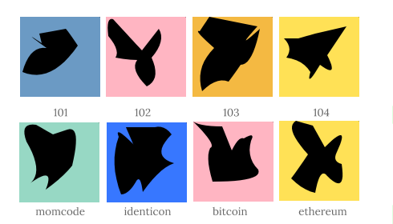

# moji
Sample Moji identicon JavaScript implementation

This is a sample JavaScript implementation of an identicon algorithm described in: LUGGEN, Michael. _[Moji: The advent of large identifiers and how to conquer them as human](https://exascale.info/assets/pdf/students/MSc_Thesis_-_Michael_Luggen__14_09_2012.pdf)._ MSc. thesis. eXascale Infolab, University of Fribourg. 2012.
